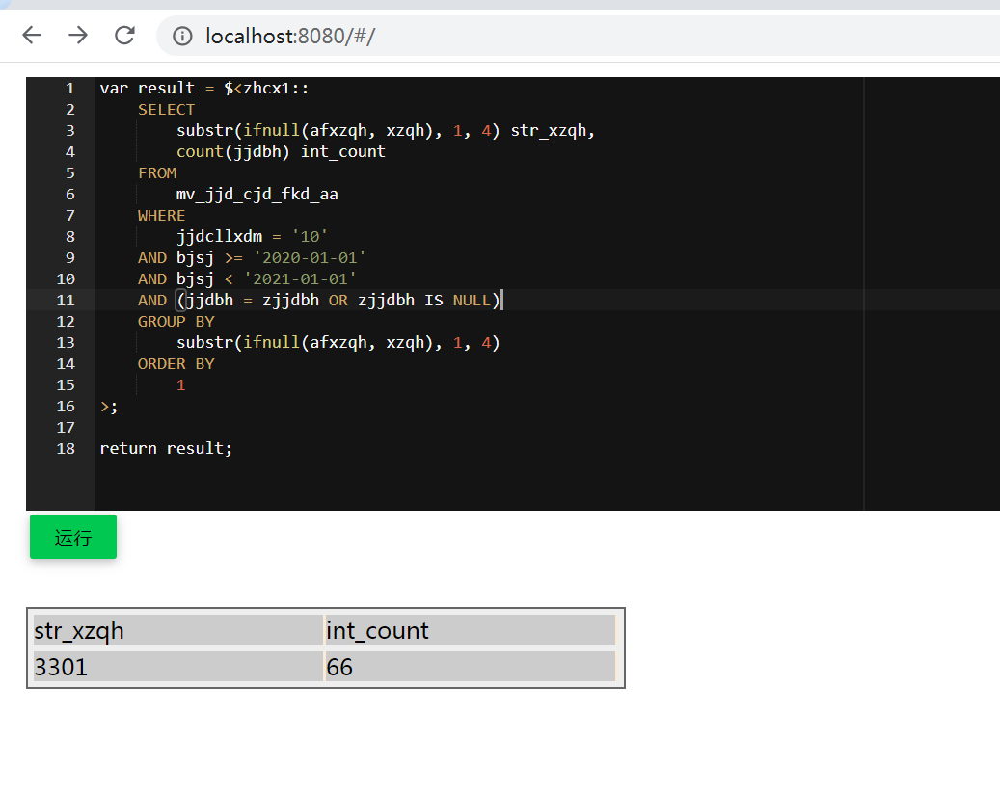

# 统计查询之友

### 主要功能

* 基于javascript的sql模板，支持存储过程，数据源切换，java方法调用。
* 基于mybatis-plus，支持运行裸写sql，给您多一种选择。
* 结合上述两个功能提供了万能http接口，让你不用写java代码也能完成老板的需求

这个万能接口非常适合统计类的需求，统计需求的特点是：需求多变，实际需求开发过程中往往发现对象设计在该场景下非常鸡肋，因为涉及到的对象都是vo，不是entity以及其它领域对象。

如果基于mybatis xml，在典型应用场景下，一个统计需求需要新增一个http接口（如果你用spring的话，可能需要新增一个controller，service），实际的查询需要一个或多个sql统计查询语句（在mybatis中，
要为每个语句新增一个mapper方法，每个mapper方法需要新增输入输出的对象映射，每个语句的sql又要在写在xml中）。
要是需求变了，上面的一连串工作都可能需要修改，费事费力，令人郁闷。

而使用本项目的方法，接口和对象省了，多个sql以存储过程的形式写在这个js里，而且所写即所见所见即所得，省去了前后端联调，发布。

没错，一行java代码都不需要写。

### 使用示例1

与前端配合，轻松实现web sql



### 使用示例2

示例1：复杂存储过程实现统计需求，创建中间表，最后将统计结果写入到结果表

```sql
var kscol2 = get("kscol2");
var jscol2 = get("jscol2");

var id1 = snowflake();
var id2 = snowflake();
var id3 = snowflake();
var id4 = snowflake();

var tmp1 = "tmp1" + id1;
var tmp2 = "tmp2" + id2;
var tmp3 = "tmp3" + id3;
var tmp4 = "tmp4" + id4;
/* 创建临时表 */
$<psc110::
create table {{tmp2}} as select col1,col2,col3 from table1 where 1=2
>;

$<psc110::
create table {{tmp4}} as select col3,min(col2) col2,count(col1) sl from table1
where col2>to_date('{{kscol2}}','yyyymmdd')
and col2<to_date('{{jscol2}}','yyyymmdd')
and col4 =10
group by col3,to_char(col2,'yyyymmdd')
>;

$<psc110::
create table {{tmp1}} as select col3,min(col2) col2,count(col1) sl from table1
where col2>to_date('{{kscol2}}','yyyymmdd')
and col2<to_date('{{jscol2}}','yyyymmdd')
and col4 in(3,5,9,11,12,13)
group by col3,to_char(col2,'yyyymmdd')
>;
/* 中间计算过程 */
$<psc110::
declare
  aa   varchar2(100);
  a2   timestamp;
  sql1 varchar2(2000);
begin

  for a in (select distinct col3
              from table1
             where col2 > to_date('{{kscol2}}','yyyymmdd')
               and col2 < to_date('{{jscol2}}','yyyymmdd')
               and col4 = 10
               and col3 is not null) loop
    aa := 1;
    for b in (select col1, col3, col2
                from table1
               where col2 > to_date('{{kscol2}}','yyyymmdd')
                 and col2 < to_date('{{jscol2}}','yyyymmdd')
                 and col4 = 10
                 and col3 = a.col3
               order by col2 ) loop
      if aa = '1' then
        aa := b.col1;
        a2 := b.col2;
        insert into {{tmp2}} values (b.col1, b.col2, b.col3);
        commit;
      else
        if (cast(b.col2 as date) - cast(a2 as date))*24*60 > 60 then
          insert into {{tmp2}} values (b.col1, b.col2, b.col3);
          commit;
          aa := b.col1;
          a2 := b.col2;
        else
          continue;
        end if;
      end if;
    end loop;

  end loop;
end;
>;

var result1 = $<psc110::
with temp1 as (select nvl(afcol6,col6) col6,col1,col2,col5,col3 from table1
where col2>to_date('{{kscol2}}','yyyymmdd')
and col2<to_date('{{jscol2}}','yyyymmdd') ) ,
temp2 as
(select * from {{tmp2}})
select c.col6,d.name,c.sl from(
select col6,sum(sl) sl from(
(select substr(a.col6,1,4)||'01' col6,sl from(
select temp1.col6,count(temp1.col1) sl from temp1,temp2
where temp1.col3=temp2.col3
and (cast(temp1.col2 as date)-cast(temp2.col2 as date))*24*60>10
and (cast(temp1.col2 as date)-cast(temp2.col2 as date))*24*60<60
group by temp1.col6 )a,
zd_col6 b
where a.col6=b.id
and b.sfsbj=1))
group by col6
union all
select a.col6 col6,sl from(
select temp1.col6,count(temp1.col1) sl from temp1,temp2
where temp1.col3=temp2.col3
and (cast(temp1.col2 as date)-cast(temp2.col2 as date))*24*60>10
and (cast(temp1.col2 as date)-cast(temp2.col2 as date))*24*60<60
group by temp1.col6 )a,
zd_col6 b
where a.col6=b.id
and b.sfsbj<>1)c,
zd_col6 d
where c.col6=d.id
order by 1
>;

/* 写入到结果表 */
for (var i = 0;i < result1.length; i++) {
  var id = snowflake();
  var col6 = result1[i].xx;
  var col6Name = result1[i].xxx;
  var sl = result1[i].xx;
  $<zlgl::
    insert into stat_cfbj_history(id,col6,col6_name,kscol2,jscol2,sl) values ('{{id}}','{{col6}}','{{col6Name}}','{{kscol2}}','{{jscol2}}','{{sl}}')
  >;
}

/* 清除中间表 */
$<psc110::
drop table {{tmp1}}
>;

$<psc110::
drop table {{tmp2}}
>;

$<psc110::
drop table {{tmp4}}
>;

return result1;
```


### 如何运行

```
mvn clean install
```

按照一般操作运行springboot项目即可。